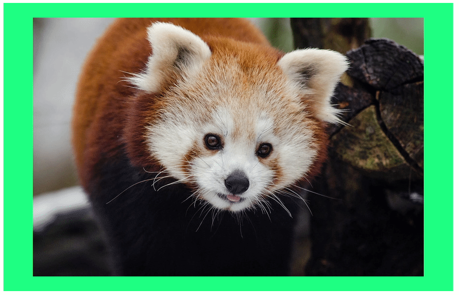
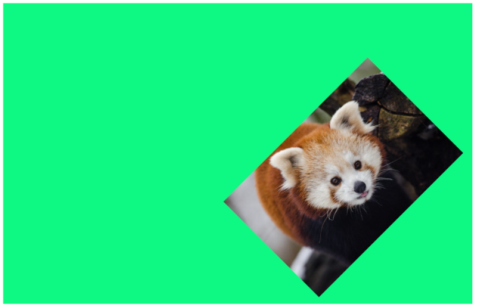
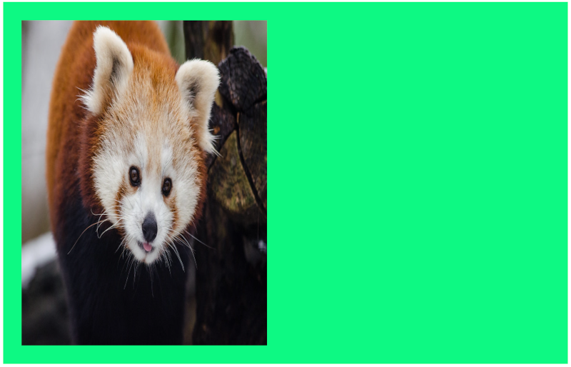
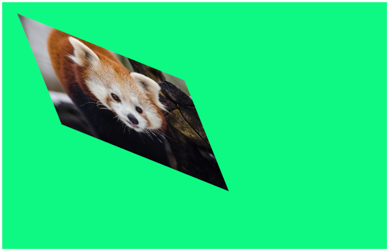
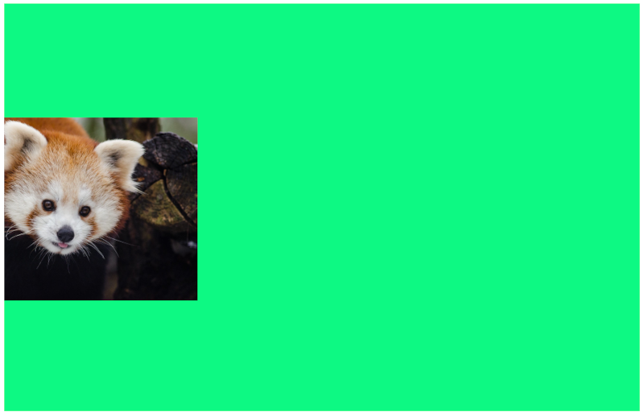

<div align="center">
  

# School of Electronic Engineering and Computer  Science

## ECS521U - INTERACTIVE MEDIA DESIGN AND PRODUCTION</br>Lab 3
</div>

### About this Lab
The purpose of this lab session is get experience working with HTML5 Canvas images and to learn transformation.

Make sure to disable the browser cache to avoid issues with caching the JavaScript and CSS files. (e.g. In Google Chrome, open the development tools using  `Ctrl + Shift + i`, then click settings and tick "Disable cache (while DevTools is open)").


## A. Setup
1. Open [html/index.html](https://github.com/giussepi/ECS521-Interactive-Media-Design-and-Production-Labs-Work-2022-Lab-3/blob/main/html/index.html) in browser (chrome/firefox/ie).
2. Open [js/script.js](https://github.com/giussepi/ECS521-Interactive-Media-Design-and-Production-Labs-Work-2022-Lab-3/blob/main/js/script.js) in text editor.

## B. Draw/Position the image on the Canvas using [HTML canvas drawImage()](https://www.w3schools.com/tags/canvas_drawimage.asp) Method.

Draw the image into canvas as follows;
   ```js
   var imageObj = new Image();

   imageObj.onload=function() {
     var destX = canvas.width / 2 - this.width / 2;
     var destY = canvas.height / 2 - this.height / 2;
     ctx.drawImage(this, destX, destY);
     console.log(destX, destY);
     console.log(this.width/2, this.height/2);
   };

   imageObj.src="../imgs/red_panda.jpg";
   ```
**Note:** The image is centered within the canvas. This is achieved by “aligning” the centres of both the canvas and the image (see variables destX and destY).

## C. Position the image on the canvas, and specify width and height of the image using [HTML canvas drawImage()](https://www.w3schools.com/tags/canvas_drawimage.asp) Method.
1. Comment the following line.
   ```js
   ctx.drawImage(this, destX, destY);
   ```
2. Add the following line.
   ```js
   ctx.drawImage(this, destX, destY, 200, 200);
   ```
## D. To do Questions
1. Crop the image in canvas using [HTML canvas drawImage()](https://www.w3schools.com/tags/canvas_drawimage.asp) Method as follows;
   ```js
   ctx.drawImage(img, sx, sy, swidth, sheight, x, y, width, height);
   ```
   * img	- Specifies the image, canvas, or video element to use
   * sx - Optional. The x coordinate where to start clipping
   * sy - Optional. The y coordinate where to start clipping
   * swidth - Optional. The width of the clipped image
   * sheight - Optional. The height of the clipped image
   * x	- The x coordinate where to place the image on the canvas
   * y	- The y coordinate where to place the image on the canvas
   * width	- Optional. The width of the image to use (stretch or reduce the image)
   * height - Optional. The height of the image to use (stretch or reduce the image)

   _Consider varying the position of the above to create 3 different sets of cropped image. The crops must keep their original locations, width and height. For instance:_

   

2. Applying Transformation on image into canvas. **Note:** Draw the original red_panda.jpg image in canvas again.

   * [Translation](https://www.w3schools.com/tags/canvas_translate.asp) as follows;
 	 ```js
     ctx.translate(tx, ty);
     ```
   * [Scaling](https://www.w3schools.com/tags/canvas_scale.asp) as follows;
	 ```js
     ctx.scale(Sx, Sy);
     ```
   * [Rotation](https://www.w3schools.com/tags/canvas_rotate.asp) as follows;
	 ```js
     ctx.rotate(Angle * Math.PI / 180);
     ```
   _Example:_

   

3. Using [ctx.transform()](https://www.w3schools.com/tags/canvas_transform.asp) Method, do the following;
Tune 6 different functions to elaborate concept of horizontal and vertical scaling, skewing and moving using the respective variables.

	_Examples_:
	* Horizontal scaling

      

    * horizontal and vertical scaling + Horizontal and vertical skewing

	  

    * horizontal and vertical scaling + Horizontal and vertical moving

	  

## Submission Instructions:
### Deadline: 21/10/22 17:00
The Submission Link is available under ASSESMENT INFORMATION/RESOURCES Section of Module Page.

### General Instruction:
- Assignments must be submitted in a .zip package or alike ( .7z .bdoc .cdoc .ddoc .gtar .tgz .gz .gzip .hqx .rar .sit .tar .zip). Code submitted in other formats will not be accepted. Corrupt or otherwise unreadable files will not be accepted.
- Make sure to compress/zip the whole folder `ECS521-Interactive-Media-Design-and-Production-Labs-Work-2022-Lab-3-main` so all your work is included in the submission.

### Submission Checklist
- [x] Has your file been saved in a zip package?
- [x] Have you clicked [Submit] after uploading?
- [x] Have you checked that the file you uploaded is the correct version?
- [x] The first time you submit, you will be required to accept the Turnitin End User Licence Agreement.
- [x] After uploading, it is your responsibility to check that your file is in the correct format and that it is readable.

Late submissions will receive late penalties in line with the late penalty policy, see EECS handbook and QMUL assessment handbook.

### Specific Instructions:
1. Each fully answered question gives you a third of the marks.


## Good Luck!
